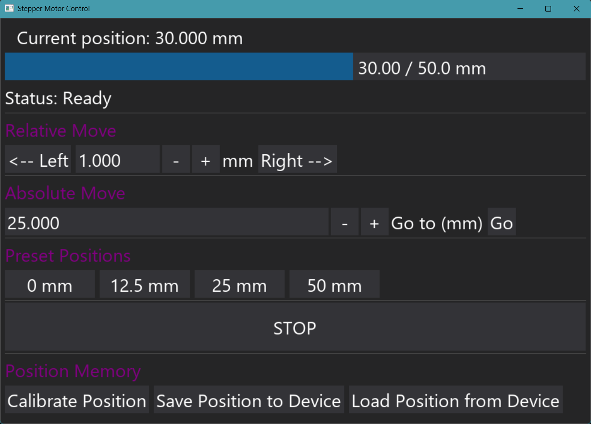

# Stepper Motor Control GUI

A Python-based graphical user interface for the precise control of a stepper motor via Arduino. This application provides real-time feedback and memory features for reliable, long-term positioning tasks.



---

## Features

* **Absolute & Relative Positioning:** Move the motor *to* a specific millimeter position or *by* a certain amount.
* **Real-time Visual Feedback:** A text display and a progress bar show the current position within the 0-50 mm range.
* **Manual Position Calibration:** If the physical position drifts, you can instantly recalibrate the system's coordinates without any motor movement.
* **Manual EEPROM Control:** Manually **Save** the current position to the Arduino's non-volatile memory and **Load** it back on demand. This prevents EEPROM wear from constant writes.
* **Robust Command Queue:** Rapid inputs are queued and executed sequentially, ensuring no commands are lost and the GUI remains responsive.
* **Emergency Stop:** Immediately halt any ongoing movement.
* **Auto-Save on Computer Sleep:** Automatically saves the motor's position to the device EEPROM if the PC is put to sleep, preventing loss of position.

---

## Requirements

### Hardware
* An Arduino UNO R3
* A stepper motor (QMOT QSH4218-51-10-049)
* A DRV8825 stepper motor driver 
* A CNC Shield
* A separate 12V DC power supply for the stepper motor (variable voltage preferred)

### Software
* [Arduino IDE](https://www.arduino.cc/en/software)
* Python 3.11
* Required Python libraries: [
    pyserial,
    time,
    dearpygui,
    sys,
    win32api,
    win32con,
    win32gui,
    deque,
    wxpython,
    pyinstaller
]
* Required Arduino libraries: [
    Accelstepper  #huge thanks
]

## Usage

1.  Ensure your hardware is wired correctly and the Arduino is connected to your PC via USB.
2.  Check the COM port for your Arduino in the Windows Device Manager or your OS equivalent.
3.  Open the Python script and change the port if necessary (the default is `'COM5'`).
    ```python
    controller = StepperController(port='COM5')
    ```
4.  Run the main executable from the dist folder:
    ```bash
    gui_control_v3.exe
    ```

---